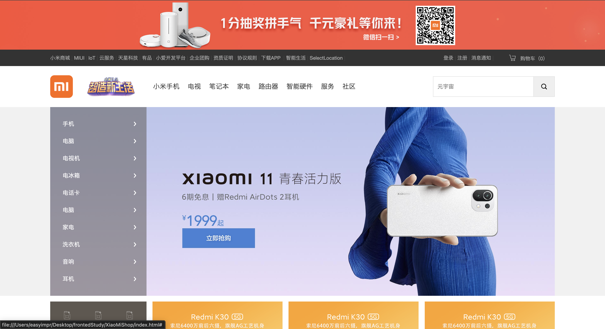

# XiaoMiShop - 小米商城静态页面

这是一个使用 HTML 和 CSS 构建的小米商城静态页面项目，仿照小米官网进行练习。

## 项目结构

```
XiaoMiShop/
├── index.html          # 主页面
├── css/
│   ├── reset.css       # CSS重置样式
│   ├── mi.css          # 主样式文件
│   └── iconfont/       # 图标字体库
├── image/              # 项目图片资源
└── README.md
```

## 主要功能模块

- **顶部广告** - 顶部横幅广告展示
- **黑色导航栏** - 顶部导航，包含APP下载下拉菜单、购物车悬停效果
- **白色导航栏** - 主导航栏，Logo动画效果、搜索框
- **轮播图区域** - 左侧分类侧边栏（带悬停展开效果）
- **广告模块** - 快捷入口图标和广告图展示
- **手机模块** - 手机产品展示网格
- **家电模块** - 家电产品展示网格
- **视频模块** - 视频展示区域
- **页脚模块** - 服务链接、联系方式

## 技术栈

- HTML5
- CSS3
- Iconfont 图标库

## 特性

- 纯静态页面，无需构建工具
- 丰富的悬停交互效果
- CSS 动画效果

## 预览

直接在浏览器中打开 `index.html` 即可预览。

## 截图



